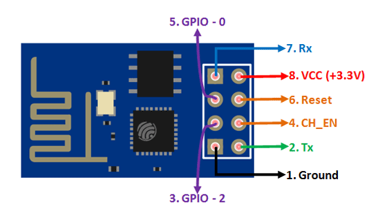
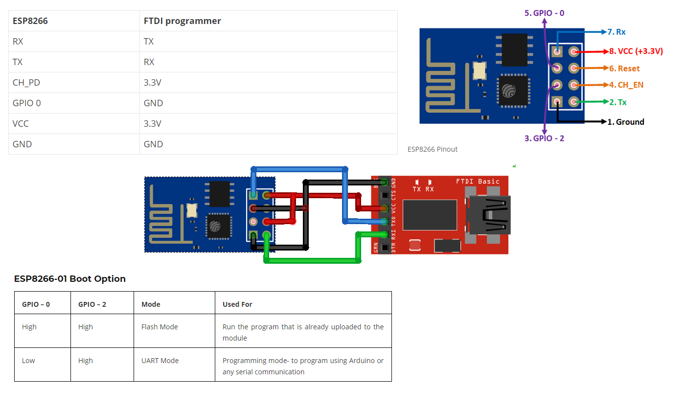

# Home Automation

## ESP8266-01 Layout

## Program the ESP8266-01

- Bring GPIO0 to GND and GPIO2 to 3.3VCC

Source: https://techiesms.com/all-in-one-home-automation-v2-using-home-assistant/

## BOM
|Item|Qty|
|----|---|
ESP32|1pc
Hi-Link HLK 5m05|1pc
DHT11 Module|1pc
IR Receiver|1pc
Screw terminal connector|5pcs
5v Relay|7pcs
Diode 1N4007|7pcs
Transistor BC547|7pcs
Rotary Switch|1pc
Resistor 330 ohms|7pcs
Slide switch|1pcs
Male header|1pcs
Capacitor 2.2uf 250v|1pcs
Capacitor 3.3uf 250v|1pcs
Resistor 200k ohms 1/4w|2pcs
Resistor 2.2 ohms 1/4w|2pcs
Resistor 10k ohms|8pcs
IR Remote|1pc
PCB|1pc

## Schematics

## PCB Gerber

